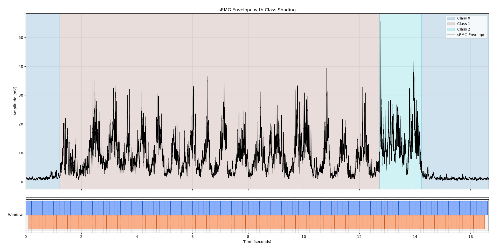
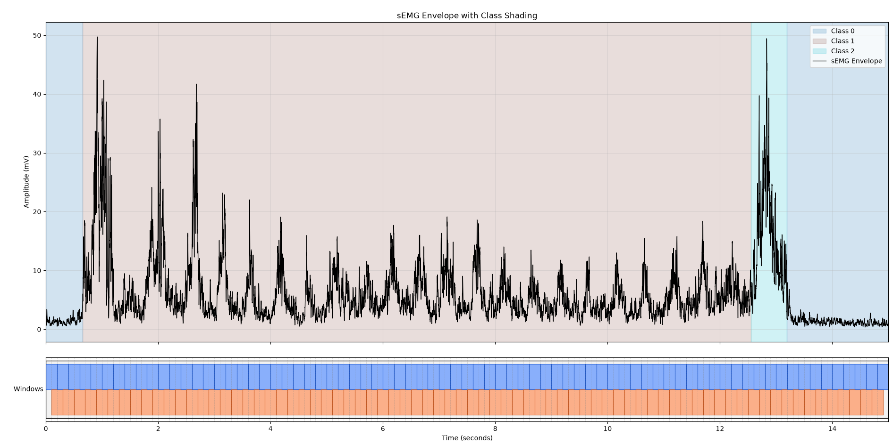

# September 7th:
I want to work on improving the classification between chewing and swallowing. The other three (null/speak/cough), which I have grouped together, are doing fine.

Looking at the graphs of chewing vs swallowing, I see something I had not earlier. Initially, I had thought that only the swallow phase had a sharp spike, but as you can see in the second graph, the chewing phase also has a sharp spike at the start. My new approach is going to focus on retrospective analysis. I will start by showing that a swallow's sharp spike often has a small chew spike preceding it.