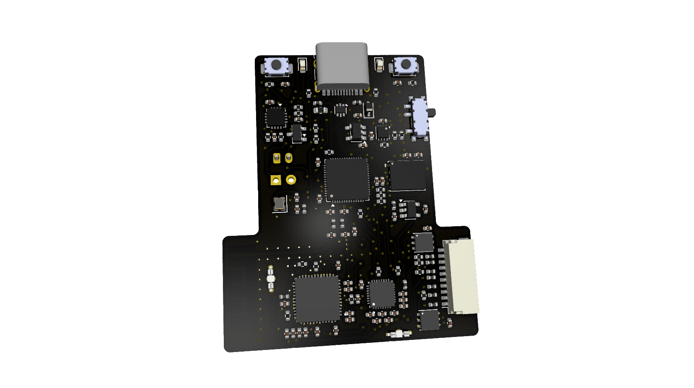
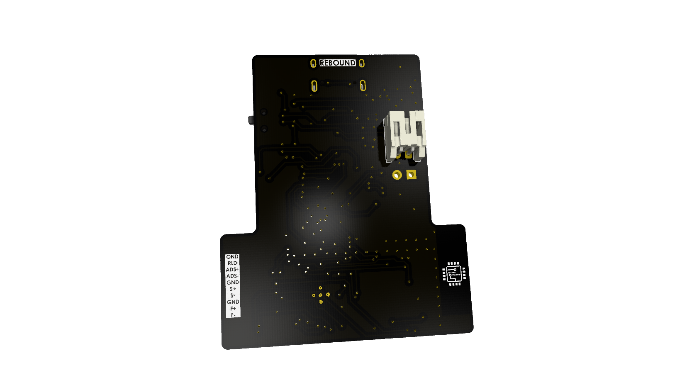
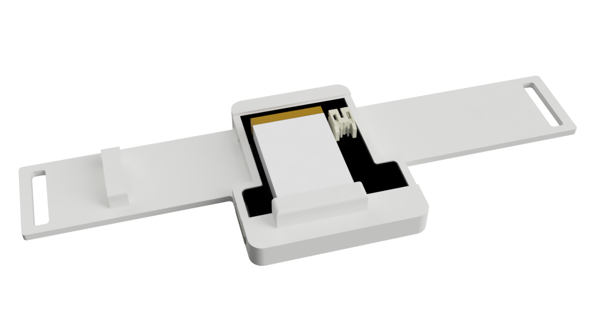
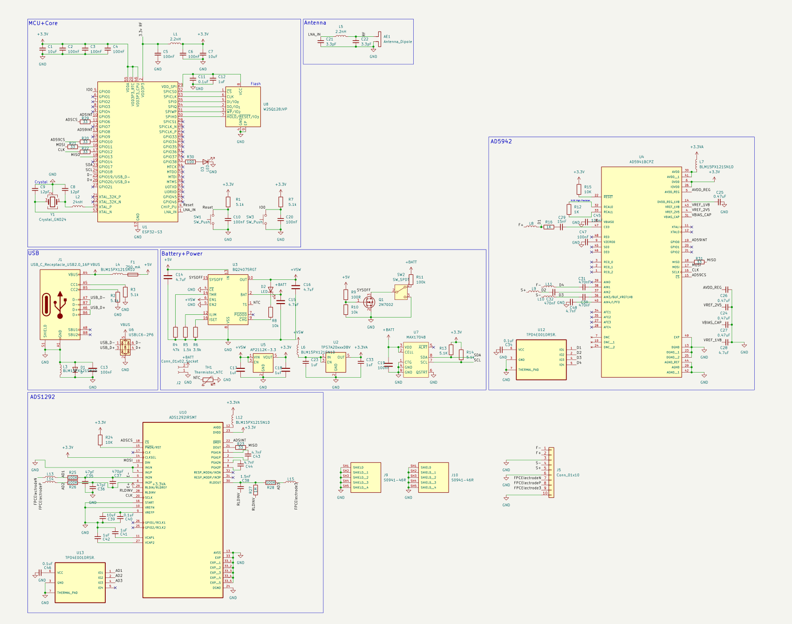
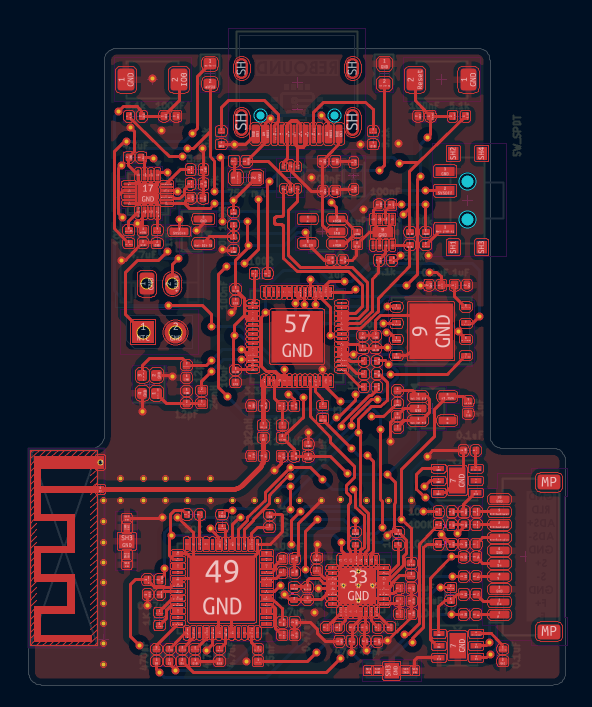
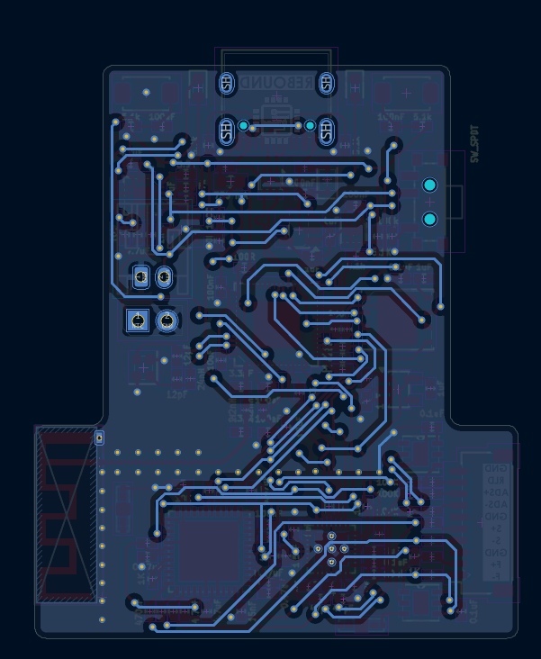

# Rebound
Low-Cost Dysphagia Patch for Post-Stroke Patients

## Features:
- ESP32S3 R8 SoC
- ADS1292 for surface electromyography (sEMG)
- AD5940 for bioimpedance analysis
- 16 MB flash with plenty of PSRAM
- Onboard battery charging

## Image Gallery:
<table align="center">
  <tr>
    <td align="center">
      
    </td>
    <td align="center">
      
    </td>
  </tr>
  <tr>
    <td align="center" colspan="2">
      
    </td>
  </tr>
</table>

## About The Project
Created after learning about the dangers that post-stroke patients can face in my EMT class, Rebound is designed to assist those who may be struggling to recognize silent aspirations, ie, when food or liquid enters the airway and lungs instead of heading to the stomach. Traumatic brain injury, Parkinson's, and ALS can also cause individuals to experience this. Gone unrecognized, silent aspirations can lead to pneumonia and potenially respiratory arrest. Rebound is meant to be worn while eating or drinking, which will enable it to constantly scan for possible signs of a silent aspiration. In the event of one, the device will immediately alert the user to prevent further complications.

## Schematic And PCB

<table align="center">
  <tr>
    <td align="center" colspan="2">
      
    </td>
  </tr>
  <tr>
     <td align="center">
      
    </td>
    <td align="center">
      
    </td>
  </tr>
</table>

## Assembly
Once the PCB has been assembled, crimp and assemble the JST SH male connector with 10 wires. From left to right when viewed from above, the wires should be part of the 4-core strand, the 3-core strand, and another 3-core strand. Cut and strip the wires on the female electrode buttons and solder one to each of the wires not labeled GND. Then, place the PCB in the case, with the T-side pointing down. The case is meant to be worn on the backside of the neck, on a relatively flat and stiff portion to prevent the device from flexing. Plug in the JST connector and route the cables through the wire harness on the left side. Attach the RLD electrode on a bony prominence, such as the collarbone. All the following positions are based on the perspective of the user. The ADS+ electrode goes on the left half of the submental area (beneath the chin) when split vertically. The ADS- electrode goes on the right half of the submental area. The S+ electrode goes on the left sternocleidomastoid muscle. The F+ electrode goes between the S+ electrode and the Adam's Apple. The F- electrode goes on the other side of the Adam's Apple. Finally, the S- electrode goes on the right sternocleidomastoid muscle. The S+, F+, F-, and S- electrodes should all be in the same horizontal plane. Ensure none of the 7 electrodes overlap.

## How It Works
The combination of the ADS1292 and AD5940 ICs allows the device to recognize when a swallow is "off beat". Trained on data provided by a UCLA study, the ADS1292 uses its sEMG abilities to monitor the activation of submental muscles that elevate the larynx to protect the airway during swallowing. Using a random forest algorithm, the device determines if the action performed was a swallow. By calculating the delta between the swallow and an object detected in the throat by the AD5940 and running it through a one-class SVM, whether or not a silent aspiration was performed can be determined.

## BOM
|Part                       |Quantity            |Price                |Link                                                                                |||  |                                          |
|---------------------------|--------------------|---------------------|------------------------------------------------------------------------------------|----------|---------|---------|--------------------------------------------------|
|PCB+Stencil                |1 Order             |$57.10               |JLCPCB Quote                                                                        |          |         |         |                                                  |
|PCB Parts                  |1 Order             |$92.88               |See Below                                                                           |          |         |         |                                                  |
|3D Printed Case            |1                   |$6.13                |JLC3DP Quote                                                                        |          |         |         |                                                  |
|Multi-Core Wire            |1x 3 Core, 1x 4 Core|$4.06                |https://www.aliexpress.us/item/2255800378204277.html                                |          |         |         |                                                  |
|Electrodes                 |1 Pack of 10        |$13.85               |https://www.amazon.com/TENS-Electrodes-Premium-Replacement-Discount/dp/B01BLYJEPK/  |          |         |         |                                                  |
|Shield Cap Holder          |1 Pack of 5         |$10.50               |https://www.aliexpress.us/item/3256808839294920.html                                |          |         |         |                                                  |
|Aluminum For Shield Cap    |1 Sheet             |$19.28               |https://www.aliexpress.us/item/3256807961227119.html                                |          |         |         |                                                  |
|JST SH Pins                |1 Box               |$4.36                |https://www.aliexpress.us/item/3256808432090471.html                                |          |         |         |                                                  |
|Electrode Buttons          |1 Pack of 10        |$3.21                |https://www.aliexpress.us/item/3256806634536037.html                                |          |         |         |                                                  |
|Velcro Straps              |1                   |$1.91                |https://www.aliexpress.us/item/3256808752475373.html                                |          |         |         |                                                  |
|LiPo Battery               |1                   |$9.00                |https://www.amazon.com/Battery-Rechargeable-Lithium-Polymer-Connector/dp/B09F9W7Z6J/|          |         |         |                                                  |
|                           |Total:              |$222.28              |                                                                                    |          |         |         |                                                  |
|LCSC                       |                    |                     |                                                                                    |          |         |         |                                                  |
|Description                |Quantity Needed     |Mrf#                 |Minimum Order Qty.                                                                  |Unit Price|Ext Price|LCSC#    |Link                                              |
|0.1uF                      |4                   |CL05B104KB54PNC      |100                                                                                 |0.0094    |0.94     |C307331  |https://www.lcsc.com/product-detail/C307331.html  |
|0.47uF                     |4                   |CL05A474KP5NNNC      |50                                                                                  |0.0211    |1.06     |C47339   |https://www.lcsc.com/product-detail/C47339.html   |
|1.5k                       |1                   |0402WGF1501TCE       |100                                                                                 |0.0057    |0.57     |C25867   |https://www.lcsc.com/product-detail/C25867.html   |
|1.5nF                      |1                   |GRM1555C1H152JA01D   |50                                                                                  |0.0278    |1.39     |C668348  |https://www.lcsc.com/product-detail/C668348.html  |
|100                        |1                   |0402WGF1000TCE       |100                                                                                 |0.0025    |0.25     |C25076   |https://www.lcsc.com/product-detail/C25076.html   |
|100K                       |3                   |RT0402BRE07100KL     |50                                                                                  |0.0259    |1.3      |C136979  |https://www.lcsc.com/product-detail/C136979.html  |
|100R                       |1                   |0402WGF1000TCE       |100                                                                                 |0.0025    |0.25     |C25076   |https://www.lcsc.com/product-detail/C25076.html   |
|100k                       |1                   |0402WGF1003TCE       |100                                                                                 |0.0076    |0.76     |C25741   |https://www.lcsc.com/product-detail/C25741.html   |
|100nF                      |11                  |CL05B104KB54PNC      |100                                                                                 |0.0094    |0.94     |C307331  |https://www.lcsc.com/product-detail/C307331.html  |
|10K                        |2                   |RC0402JR-0710KL      |100                                                                                 |0.0041    |0.41     |C60489   |https://www.lcsc.com/product-detail/C60489.html   |
|10k                        |2                   |RC0402JR-0710KL      |100                                                                                 |0.0041    |0.41     |C60489   |https://www.lcsc.com/product-detail/C60489.html   |
|10uF                       |3                   |CL05A106MQ5NUNC      |100                                                                                 |0.0257    |2.57     |C15525   |https://www.lcsc.com/product-detail/C15525.html   |
|12pF                       |2                   |CL05C120JB5NNNC      |100                                                                                 |0.0045    |0.45     |C26406   |https://www.lcsc.com/product-detail/C26406.html   |
|15nF                       |1                   |CC0402KRX7R9BB153    |100                                                                                 |0.0039    |0.39     |C114405  |https://www.lcsc.com/product-detail/C114405.html  |
|1K                         |1                   |4-1879208-9          |5                                                                                   |0.3163    |1.58     |C306197  |https://www.lcsc.com/product-detail/C306197.html  |
|1K                         |1                   |RT0402BRD071KL       |50                                                                                  |0.0271    |1.36     |C852624  |https://www.lcsc.com/product-detail/C852624.html  |
|1M                         |1                   |0402WGF1004TCE       |100                                                                                 |0.007     |0.7      |C26083   |https://www.lcsc.com/product-detail/C26083.html   |
|1uF                        |7                   |CL05A105KA5NQNC      |50                                                                                  |0.0162    |0.81     |C52923   |https://www.lcsc.com/product-detail/C52923.html   |
|2.2nH                      |1                   |LQG15HS2N2S02D       |50                                                                                  |0.0131    |0.66     |C86061   |https://www.lcsc.com/product-detail/C86061.html   |
|2.2nH                      |1                   |LQW15AN2N2C10D       |10                                                                                  |0.0628    |0.63     |C91240   |https://www.lcsc.com/product-detail/C91240.html   |
|24nH                       |1                   |MLG1005S24NHT000     |50                                                                                  |0.0078    |0.39     |C275275  |https://www.lcsc.com/product-detail/C275275.html  |
|2N7002                     |1                   |2N7002               |50                                                                                  |0.0176    |0.88     |C8545    |https://www.lcsc.com/product-detail/C8545.html    |
|3.3pF                      |2                   |GJM1555C1H3R3WB01D   |20                                                                                  |0.0374    |0.75     |C88892   |https://www.lcsc.com/product-detail/C88892.html   |
|3.9k                       |1                   |RC0402FR-073K9L      |100                                                                                 |0.0055    |0.55     |C131467  |https://www.lcsc.com/product-detail/C131467.html  |
|33                         |6                   |0402WGF330JTCE       |100                                                                                 |0.0034    |0.34     |C25105   |https://www.lcsc.com/product-detail/C25105.html   |
|4.7nF                      |2                   |GRM1555C1H472JE01D   |50                                                                                  |0.02      |1        |C1518204 |https://www.lcsc.com/product-detail/C1518204.html |
|4.7nF                      |1                   |0402B472K500NT       |100                                                                                 |0.0072    |0.72     |C1538    |https://www.lcsc.com/product-detail/C1538.html    |
|4.7uF                      |4                   |CL05A475MP5NRNC      |50                                                                                  |0.0233    |1.17     |C23733   |https://www.lcsc.com/product-detail/C23733.html   |
|470nF                      |3                   |GRM155R71C474KE01D   |20                                                                                  |0.0514    |1.03     |C471404  |https://www.lcsc.com/product-detail/C471404.html  |
|470pF                      |1                   |0402B471K500NT       |100                                                                                 |0.0075    |0.75     |C1537    |https://www.lcsc.com/product-detail/C1537.html    |
|47k                        |1                   |0402WGF4702TCE       |100                                                                                 |0.0063    |0.63     |C25792   |https://www.lcsc.com/product-detail/C25792.html   |
|47pF                       |2                   |0402CG470J500NT      |100                                                                                 |0.0152    |1.52     |C1567    |https://www.lcsc.com/product-detail/C1567.html    |
|5.1K                       |1                   |0402WGF5101TCE       |100                                                                                 |0.0057    |0.57     |C25905   |https://www.lcsc.com/product-detail/C25905.html   |
|5.1k                       |5                   |0402WGF5101TCE       |100                                                                                 |0.0057    |0.57     |C25905   |https://www.lcsc.com/product-detail/C25905.html   |
|750 mA                     |1                   |BSMD0603-075-6V      |10                                                                                  |0.0672    |0.67     |C914092  |https://www.lcsc.com/product-detail/C914092.html  |
|AD5941BCPZ                 |1                   |AD5941BCPZ           |1                                                                                   |20.615    |20.62    |C503573  |https://www.lcsc.com/product-detail/C503573.html  |
|ADS1292IRSMT               |1                   |ADS1292IRSMT         |1                                                                                   |9.4973    |9.5      |C89288   |https://www.lcsc.com/product-detail/C89288.html   |
|AP2112K-3.3                |1                   |AP2112K-3.3TRG1(MS)  |5                                                                                   |0.0748    |0.37     |C22365427|https://www.lcsc.com/product-detail/C22365427.html|
|BLM15PX121SN1D             |12                  |BLM15PX121SN1D       |50                                                                                  |0.0166    |0.83     |C88970   |https://www.lcsc.com/product-detail/C88970.html   |
|BQ24075RGT                 |1                   |BQ24075RGTR          |1                                                                                   |1.199     |1.2      |C15464   |https://www.lcsc.com/product-detail/C15464.html   |
|Conn_01x02_Socket          |1                   |S2B-PH-K-S(LF)(SN)   |20                                                                                  |0.0394    |0.79     |C173752  |https://www.lcsc.com/product-detail/C173752.html  |
|Conn_01x10                 |1                   |SM10B-SRSS-TB(LF)(SN)|1                                                                                   |0.4986    |0.5      |C160409  |https://www.lcsc.com/product-detail/C160409.html  |
|Crystal_GND24              |1                   |ECS-400-10-37-CKM-TR |1                                                                                   |0.9628    |0.96     |C5246840 |https://www.lcsc.com/product-detail/C5246840.html |
|D                          |1                   |BSD3C051V            |10                                                                                  |0.0661    |0.66     |C151996  |https://www.lcsc.com/product-detail/C151996.html  |
|ESP32-S3                   |1                   |ESP32-S3R8           |1                                                                                   |3.1722    |3.17     |C2913194 |https://www.lcsc.com/product-detail/C2913194.html |
|LED                        |1                   |LTST-C193TGKT-5A     |20                                                                                  |0.034     |0.68     |C12065   |https://www.lcsc.com/product-detail/C12065.html   |
|LED                        |1                   |KT-0603Y             |50                                                                                  |0.0107    |0.54     |C2287    |https://www.lcsc.com/product-detail/C2287.html    |
|MAX17048                   |1                   |MAX17048G+T10        |1                                                                                   |2.1836    |2.18     |C2682616 |https://www.lcsc.com/product-detail/C2682616.html |
|SW_Push                    |2                   |TS-1088-AR02016      |10                                                                                  |0.0529    |0.53     |C720477  |https://www.lcsc.com/product-detail/C720477.html  |
|SW_SPDT                    |1                   |SSSS811101           |5                                                                                   |0.149     |0.75     |C109335  |https://www.lcsc.com/product-detail/C109335.html  |
|TPD4E001DRSR.              |2                   |TPD4E001DRSR         |2                                                                                   |0.957     |1.91     |C1973310 |https://www.lcsc.com/product-detail/C1973310.html |
|TPS7A20xxxDBV              |1                   |TPS7A2033PDBVR       |5                                                                                   |0.2398    |1.2      |C2862740 |https://www.lcsc.com/product-detail/C2862740.html |
|USBLC6-2P6                 |1                   |USBLC6-2P6           |5                                                                                   |0.2787    |1.39     |C15999   |https://www.lcsc.com/product-detail/C15999.html   |
|USB_C_Receptacle_USB2.0_16P|1                   |TYPE-C-31-M-12       |5                                                                                   |0.1716    |0.86     |C165948  |https://www.lcsc.com/product-detail/C165948.html  |
|W25Q128JVP                 |1                   |W25Q128JVPIQ         |1                                                                                   |3.7478    |3.75     |C190862  |https://www.lcsc.com/product-detail/C190862.html  |
|JST SHR-10V-S-B            |1                   |SHR-10V-S-B          |5                                                                                   |0.1598    |$0.80    |C394370  |https://www.lcsc.com/product-detail/C394370.html  |
|                           |                    |                     |                                                                                    |Subtotal  |$82.16   |         |                                                  |
|                           |                    |                     |                                                                                    |Shipping  |$10.72   |         |                                                  |
|                           |                    |                     |                                                                                    |Total     |$92.88   |         |                                                  |
